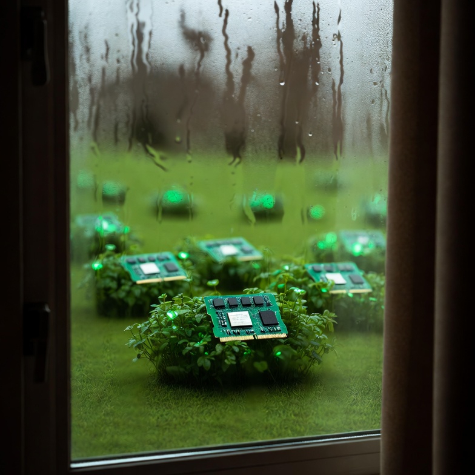
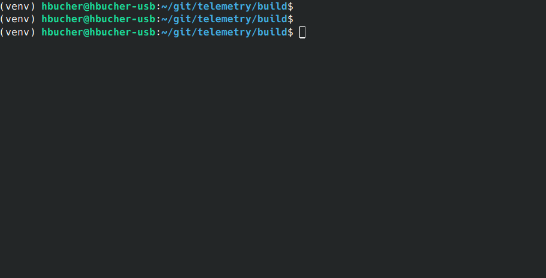

<p align="center">
  
</p>

# memglass

Real-time cross-process observation of C++ POD objects via shared memory.

<p align="center">
  
</p>

## What it does

A producer application allocates POD structs in shared memory with automatic field registration. An observer process maps the same memory to inspect live object state - no serialization, no IPC overhead, just direct memory reads.

```
Producer Process                    Observer Process
     │                                    │
     ▼                                    ▼
┌─────────┐    ┌───────────────┐    ┌─────────┐
│ Objects │───▶│ Shared Memory │◀───│ Reader  │
└─────────┘    └───────────────┘    └─────────┘
```

## Building

```bash
mkdir build && cd build
cmake ..
make
```

### Dependencies

- C++20 compiler (GCC 10+, Clang 12+)
- libclang-dev (for memglass-gen code generator)
- fmt library (fetched automatically if not found)

## Quick Start

### 1. Define your types

```cpp
// trading_types.hpp
#include <cstdint>

// Annotations: @atomic for primitives, @seqlock for compound Guarded<T> fields
struct [[memglass::observe]] Quote {
    int64_t bid_price;      // @atomic
    int64_t ask_price;      // @atomic
    uint32_t bid_size;      // @atomic
    uint32_t ask_size;      // @atomic
    uint64_t timestamp_ns;  // @atomic
};

struct [[memglass::observe]] Position {
    uint32_t symbol_id;
    int64_t quantity;       // @atomic
    int64_t avg_price;
    int64_t realized_pnl;
    int64_t unrealized_pnl;
};

struct [[memglass::observe]] Security {
    Quote quote;
    Position position;
};
```

### 2. Generate type registration code

```bash
./build/memglass-gen trading_types.hpp -o trading_types_generated.hpp
```

This generates:
- **Type registration functions** for runtime reflection
- **Producer wrapper classes** (`QuoteProducer`, `PositionProducer`) that enforce synchronization
- **`make_producer()` helpers** for creating wrappers

### 3. Create a producer

```cpp
#include <memglass/memglass.hpp>
#include "trading_types.hpp"
#include "trading_types_generated.hpp"

int main() {
    memglass::init("trading_engine");
    memglass::generated::register_all_types();

    auto* aapl = memglass::create<Security>("AAPL");

    // Use generated producer wrappers for synchronized writes
    auto quote_prod = memglass::generated::make_producer(&aapl->quote);
    auto pos_prod = memglass::generated::make_producer(&aapl->position);

    quote_prod.set_bid_price(15000);
    pos_prod.set_quantity(100);

    while (running) {
        quote_prod.set_bid_price(quote_prod.get_bid_price() + random_delta());
        quote_prod.set_timestamp_ns(now());
    }

    memglass::shutdown();
}
```

The producer wrappers use `std::atomic_ref` for `@atomic` fields, ensuring observers on other CPU cores see consistent values without torn reads.

### 4. Observe with the TUI

```bash
./build/memglass trading_engine
```

The interactive browser shows all objects with expandable nested fields, auto-refreshing every 500ms.

```
=== Memglass Browser ===
PID: 12345  Objects: 5  Seq: 5
--------------------------------------------------------------------------------
[-] AAPL (Security)
  [-] quote
        bid_price        =          15023 [atomic]
        ask_price        =          15028 [atomic]
        bid_size         =            142 [atomic]
        ask_size         =             98 [atomic]
        timestamp_ns     = 1704825432123456789 [atomic]
  [+] position
[+] MSFT (Security)
[+] GOOG (Security)
```

**Controls:** ↑/↓ or j/k to navigate, Enter/Space to expand/collapse, q to quit

### 5. Or use the Web UI

```bash
./build/memglass --web trading_engine
# Then open http://localhost:8080
```

<p align="center">
  
</p>

The web interface provides the same tree view with:
- Auto-refresh with value change highlighting
- Expand/collapse all buttons
- Atomicity badges (atomic, seqlock, locked)
- Dark theme optimized for monitoring

### 6. Or use the Python client

```python
from memglass import MemglassClient

client = MemglassClient("http://localhost:8080")

for snapshot in client.stream(interval=0.5):
    aapl = snapshot.get_object("AAPL")
    if aapl:
        print(f"AAPL bid: {aapl['quote.bid_price']}")
```

See [clients/python/](clients/python/) for full documentation.

### 7. Record and analyze diffs

```bash
# Record changes every 100ms to a binary file
./build/memglass-diff -i 100 -f binary -o changes.mgd trading_engine

# Or stream text diffs to stdout
./build/memglass-diff -i 500 trading_engine

# Decode binary file to text
./build/memglass-diff --decode changes.mgd
```

See [docs/memglass-diff.md](docs/memglass-diff.md) for format details.

### 8. Or write a custom C++ observer

```cpp
#include <memglass/observer.hpp>

int main() {
    memglass::Observer obs("trading_engine");
    obs.connect();

    while (true) {
        for (const auto& obj : obs.objects()) {
            auto view = obs.get(obj);
            if (view) {
                int64_t bid = view["quote.bid_price"];
                int64_t qty = view["position.quantity"];
                printf("%s: bid=%ld qty=%ld\n", obj.label.c_str(), bid, qty);
            }
        }
        std::this_thread::sleep_for(std::chrono::milliseconds(100));
    }
}
```

## Field Annotations

Use comments to specify synchronization semantics. The code generator creates producer wrappers that enforce these:

```cpp
struct Data {
    int64_t counter;      // @atomic - uses std::atomic_ref for primitives
    Guarded<Compound> cmp;// @seqlock - for compound types needing atomic update
    Locked<Buffer> buf;   // @locked - spinlock for complex operations
    int32_t simple;       // (no annotation) - direct read/write
};
```

| Annotation | Use Case | Producer Wrapper |
|------------|----------|------------------|
| `@atomic` | Primitive values (int64_t, double, etc.) | `std::atomic_ref<T>` |
| `@seqlock` | Compound structs updated atomically | `Guarded<T>::write()` |
| `@locked` | Read-modify-write, strings | `Locked<T>::write()` |
| (none) | Non-critical, debug data | Direct assignment |

**Important:** Use `@atomic` for primitive fields. Use `@seqlock` only for compound struct fields declared as `Guarded<T>`.

## Constraints

- **POD types only** - must be `std::is_trivially_copyable_v<T>`
- No `std::string`, `std::vector`, raw pointers
- Use `char name[N]` for strings, `std::array<T,N>` for fixed arrays
- Nested structs are supported and flattened with dot notation

## Documentation

- [Quick Start Guide](docs/quickstart.md) - Get up and running in 5 minutes
- [Advanced Guide](docs/advanced.md) - Nested structs, synchronization, annotations
- [Architecture](docs/architecture.md) - Internal design and memory layout
- [API Reference](docs/api-reference.md) - Complete API documentation (includes Web API)
- [Diff Tool](docs/memglass-diff.md) - Snapshot diff recorder and binary format
- [Python Client](clients/python/README.md) - Python client for scripting and automation

## Project Structure

```
├── include/memglass/     # Public headers
│   ├── memglass.hpp      # Producer API
│   ├── observer.hpp      # Observer API
│   ├── types.hpp         # Core types
│   └── ...
├── src/                  # Library implementation
├── tools/
│   ├── memglass.cpp      # TUI and Web observer (--web flag)
│   ├── memglass-diff.cpp # Snapshot diff recorder
│   └── memglass-gen/     # Code generator
├── clients/
│   └── python/           # Python client for Web API
├── examples/             # Trading example
├── docs/                 # Documentation
└── tests/                # Unit tests
```

## License

MIT
